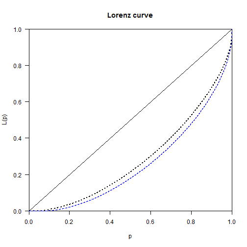

Inequality by Demographic Factors - Basel
========================================================


Load Library

```r
library(foreign,quietly=TRUE,warn.conflicts=FALSE)
library(plyr,quietly=TRUE,warn.conflicts=FALSE)
library(dplyr,quietly=TRUE,warn.conflicts=FALSE)
library(ggplot2,quietly=TRUE,warn.conflicts=FALSE)
library(ineq,quietly=TRUE,warn.conflicts=FALSE)
library(IC2,quietly=TRUE,warn.conflicts=FALSE)
```

Load Data 

```r
load("P:/WGS/FBS/ISS/Projekte laufend/SNF Ungleichheit/Valorisierung/Ungleichheitsworkshop Neuchatel 2014/Inequality by demographic factors/Auswertungen/datenbs1.Rda")
load("P:/WGS/FBS/ISS/Projekte laufend/SNF Ungleichheit/Valorisierung/Ungleichheitsworkshop Neuchatel 2014/Inequality by demographic factors/Auswertungen/datenbs2.Rda")
```


Achtung: 
* Einkommen sind nicht preisbereinigt. Vergleich der Mittelwerte über die Zeit sind damit nicht zu interpretieren
* Es wird die Ungleichheit zwischen Steuereinheiten und nicht zwischen Haushalten untersucht
* Es wurde keine Äquivalenzgewichtung vorgenommen


<br><br>
<br><br>

# Change of social structure and between group inequality

## Periode 1: 1991 to 2003

### 1991

**Agegroup and mean taxable income**

```r
prop.table(table(datenbs1$agegroup[datenbs1$steuerjahr==1991]))
```

```
## 
##  18-25  26-65    66+ 
## 0.1185 0.6255 0.2561
```

```r
by(datenbs1$einkommen_steuerbar[datenbs1$steuerjahr==1991],datenbs1$agegroup[datenbs1$steuerjahr==1991],mean)
```

```
## datenbs1$agegroup[datenbs1$steuerjahr == 1991]: 18-25
## [1] 22675
## -------------------------------------------------------- 
## datenbs1$agegroup[datenbs1$steuerjahr == 1991]: 26-65
## [1] 57229
## -------------------------------------------------------- 
## datenbs1$agegroup[datenbs1$steuerjahr == 1991]: 66+
## [1] 46521
```

**Housholdstructur and mean income**

```r
prop.table(table(datenbs1$household[datenbs1$steuerjahr==1991]))
```

```
## 
##    Married with Kid(s) Married without Kid(s)             Single man 
##               0.294072               0.140257               0.228321 
##           Single women             Single dad             Single mom 
##               0.325016               0.005760               0.006575
```

```r
by(datenbs1$einkommen_steuerbar[datenbs1$steuerjahr==1991],datenbs1$household[datenbs1$steuerjahr==1991],mean)
```

```
## datenbs1$household[datenbs1$steuerjahr == 1991]: Married with Kid(s)
## [1] 63978
## -------------------------------------------------------- 
## datenbs1$household[datenbs1$steuerjahr == 1991]: Married without Kid(s)
## [1] 73856
## -------------------------------------------------------- 
## datenbs1$household[datenbs1$steuerjahr == 1991]: Single man
## [1] 40975
## -------------------------------------------------------- 
## datenbs1$household[datenbs1$steuerjahr == 1991]: Single women
## [1] 34986
## -------------------------------------------------------- 
## datenbs1$household[datenbs1$steuerjahr == 1991]: Single dad
## [1] 68334
## -------------------------------------------------------- 
## datenbs1$household[datenbs1$steuerjahr == 1991]: Single mom
## [1] 34010
```


### 2003 

**Agegroup and mean income**

```r
prop.table(table(datenbs1$agegroup[datenbs1$steuerjahr==2003]))
```

```
## 
##  18-25  26-65    66+ 
## 0.1180 0.6274 0.2545
```

```r
by(datenbs1$einkommen_steuerbar[datenbs1$steuerjahr==2003],datenbs1$agegroup[datenbs1$steuerjahr==2003],mean)
```

```
## datenbs1$agegroup[datenbs1$steuerjahr == 2003]: 18-25
## [1] 17961
## -------------------------------------------------------- 
## datenbs1$agegroup[datenbs1$steuerjahr == 2003]: 26-65
## [1] 65479
## -------------------------------------------------------- 
## datenbs1$agegroup[datenbs1$steuerjahr == 2003]: 66+
## [1] 56526
```

**Housholdstructur and mean income**

```r
prop.table(table(datenbs1$household[datenbs1$steuerjahr==2003]))
```

```
## 
##    Married with Kid(s) Married without Kid(s)             Single man 
##               0.244465               0.133485               0.269064 
##           Single women             Single dad             Single mom 
##               0.343172               0.001384               0.008430
```

```r
by(datenbs1$einkommen_steuerbar[datenbs1$steuerjahr==2003],datenbs1$household[datenbs1$steuerjahr==2003],mean)
```

```
## datenbs1$household[datenbs1$steuerjahr == 2003]: Married with Kid(s)
## [1] 81716
## -------------------------------------------------------- 
## datenbs1$household[datenbs1$steuerjahr == 2003]: Married without Kid(s)
## [1] 83996
## -------------------------------------------------------- 
## datenbs1$household[datenbs1$steuerjahr == 2003]: Single man
## [1] 43989
## -------------------------------------------------------- 
## datenbs1$household[datenbs1$steuerjahr == 2003]: Single women
## [1] 42405
## -------------------------------------------------------- 
## datenbs1$household[datenbs1$steuerjahr == 2003]: Single dad
## [1] 61012
## -------------------------------------------------------- 
## datenbs1$household[datenbs1$steuerjahr == 2003]: Single mom
## [1] 39298
```

<br><br>
<br><br>

## Periode 2: 2006 to 2011

### 2006

**Agegroup and mean Total income**

```r
prop.table(table(datenbs2$agegroup[datenbs2$steuerjahr==2006]))
```

```
## 
##  18-25  26-65    66+ 
## 0.1229 0.6244 0.2527
```

```r
by(datenbs2$TOTEINK[datenbs2$steuerjahr==2006],datenbs2$agegroup[datenbs2$steuerjahr==2006],mean)
```

```
## datenbs2$agegroup[datenbs2$steuerjahr == 2006]: 18-25
## [1] 20135
## -------------------------------------------------------- 
## datenbs2$agegroup[datenbs2$steuerjahr == 2006]: 26-65
## [1] 84115
## -------------------------------------------------------- 
## datenbs2$agegroup[datenbs2$steuerjahr == 2006]: 66+
## [1] 71721
```

**Housholdstructur and mean income**

```r
prop.table(table(datenbs2$household[datenbs2$steuerjahr==2006]))
```

```
## 
##    Married with Kid(s) Married without Kid(s)             Single man 
##               0.232347               0.129318               0.278446 
##           Single women             Single dad             Single mom 
##               0.348484               0.001999               0.009405
```

```r
by(datenbs2$TOTEINK[datenbs2$steuerjahr==2006],datenbs2$household[datenbs2$steuerjahr==2006],mean)
```

```
## datenbs2$household[datenbs2$steuerjahr == 2006]: Married with Kid(s)
## [1] 101553
## -------------------------------------------------------- 
## datenbs2$household[datenbs2$steuerjahr == 2006]: Married without Kid(s)
## [1] 126485
## -------------------------------------------------------- 
## datenbs2$household[datenbs2$steuerjahr == 2006]: Single man
## [1] 51005
## -------------------------------------------------------- 
## datenbs2$household[datenbs2$steuerjahr == 2006]: Single women
## [1] 51798
## -------------------------------------------------------- 
## datenbs2$household[datenbs2$steuerjahr == 2006]: Single dad
## [1] 90459
## -------------------------------------------------------- 
## datenbs2$household[datenbs2$steuerjahr == 2006]: Single mom
## [1] 113626
```


### 2011

**Agegroup and mean income**

```r
prop.table(table(datenbs2$agegroup[datenbs2$steuerjahr==2011]))
```

```
## 
##  18-25  26-65    66+ 
## 0.1219 0.6272 0.2509
```

```r
by(datenbs2$TOTEINK[datenbs2$steuerjahr==2011],datenbs2$agegroup[datenbs2$steuerjahr==2011],mean)
```

```
## datenbs2$agegroup[datenbs2$steuerjahr == 2011]: 18-25
## [1] 20306
## -------------------------------------------------------- 
## datenbs2$agegroup[datenbs2$steuerjahr == 2011]: 26-65
## [1] 89110
## -------------------------------------------------------- 
## datenbs2$agegroup[datenbs2$steuerjahr == 2011]: 66+
## [1] 76405
```

**Housholdstructur and mean income**

```r
prop.table(table(datenbs2$household[datenbs2$steuerjahr==2011]))
```

```
## 
##    Married with Kid(s) Married without Kid(s)             Single man 
##               0.207103               0.127996               0.295390 
##           Single women             Single dad             Single mom 
##               0.356978               0.001906               0.010628
```

```r
by(datenbs2$TOTEINK[datenbs2$steuerjahr==2011],datenbs2$household[datenbs2$steuerjahr==2011],mean)
```

```
## datenbs2$household[datenbs2$steuerjahr == 2011]: Married with Kid(s)
## [1] 114502
## -------------------------------------------------------- 
## datenbs2$household[datenbs2$steuerjahr == 2011]: Married without Kid(s)
## [1] 134290
## -------------------------------------------------------- 
## datenbs2$household[datenbs2$steuerjahr == 2011]: Single man
## [1] 54428
## -------------------------------------------------------- 
## datenbs2$household[datenbs2$steuerjahr == 2011]: Single women
## [1] 55952
## -------------------------------------------------------- 
## datenbs2$household[datenbs2$steuerjahr == 2011]: Single dad
## [1] 92523
## -------------------------------------------------------- 
## datenbs2$household[datenbs2$steuerjahr == 2011]: Single mom
## [1] 67811
```

<br><br>
<br><br>


## Periode 3: 1991 to 2011

### 1991

**Agegroup and mean Reineinkommen**

```r
prop.table(table(datenbs1$agegroup[datenbs1$steuerjahr==1991]))
```

```
## 
##  18-25  26-65    66+ 
## 0.1185 0.6255 0.2561
```

```r
by(datenbs1$reineinkommen[datenbs1$steuerjahr==1991],datenbs1$agegroup[datenbs1$steuerjahr==1991],mean)
```

```
## datenbs1$agegroup[datenbs1$steuerjahr == 1991]: 18-25
## [1] 23915
## -------------------------------------------------------- 
## datenbs1$agegroup[datenbs1$steuerjahr == 1991]: 26-65
## [1] 64720
## -------------------------------------------------------- 
## datenbs1$agegroup[datenbs1$steuerjahr == 1991]: 66+
## [1] 52669
```

**Agegroup (more categories) and mean Reineinkommen**

```r
prop.table(table(datenbs1$alterskategorie[datenbs1$steuerjahr==1991]))
```

```
## 
##    00_26    26_35    36_45    46_55    56_65    66_75    76_85    86_95 
## 0.118457 0.191556 0.154902 0.143182 0.135847 0.120052 0.102037 0.032700 
##     95_+ 
## 0.001266
```

```r
by(datenbs1$reineinkommen[datenbs1$steuerjahr==1991],datenbs1$alterskategorie[datenbs1$steuerjahr==1991],mean)
```

```
## datenbs1$alterskategorie[datenbs1$steuerjahr == 1991]: 00_26
## [1] 23915
## -------------------------------------------------------- 
## datenbs1$alterskategorie[datenbs1$steuerjahr == 1991]: 26_35
## [1] 46726
## -------------------------------------------------------- 
## datenbs1$alterskategorie[datenbs1$steuerjahr == 1991]: 36_45
## [1] 66642
## -------------------------------------------------------- 
## datenbs1$alterskategorie[datenbs1$steuerjahr == 1991]: 46_55
## [1] 78017
## -------------------------------------------------------- 
## datenbs1$alterskategorie[datenbs1$steuerjahr == 1991]: 56_65
## [1] 73888
## -------------------------------------------------------- 
## datenbs1$alterskategorie[datenbs1$steuerjahr == 1991]: 66_75
## [1] 60182
## -------------------------------------------------------- 
## datenbs1$alterskategorie[datenbs1$steuerjahr == 1991]: 76_85
## [1] 47569
## -------------------------------------------------------- 
## datenbs1$alterskategorie[datenbs1$steuerjahr == 1991]: 86_95
## [1] 41979
## -------------------------------------------------------- 
## datenbs1$alterskategorie[datenbs1$steuerjahr == 1991]: 95_+
## [1] 27367
```

**Housholdstructur and mean income**

```r
prop.table(table(datenbs1$household[datenbs1$steuerjahr==1991]))
```

```
## 
##    Married with Kid(s) Married without Kid(s)             Single man 
##               0.294072               0.140257               0.228321 
##           Single women             Single dad             Single mom 
##               0.325016               0.005760               0.006575
```

```r
by(datenbs1$reineinkommen[datenbs1$steuerjahr==1991],datenbs1$household[datenbs1$steuerjahr==1991],mean)
```

```
## datenbs1$household[datenbs1$steuerjahr == 1991]: Married with Kid(s)
## [1] 70837
## -------------------------------------------------------- 
## datenbs1$household[datenbs1$steuerjahr == 1991]: Married without Kid(s)
## [1] 92126
## -------------------------------------------------------- 
## datenbs1$household[datenbs1$steuerjahr == 1991]: Single man
## [1] 43487
## -------------------------------------------------------- 
## datenbs1$household[datenbs1$steuerjahr == 1991]: Single women
## [1] 37755
## -------------------------------------------------------- 
## datenbs1$household[datenbs1$steuerjahr == 1991]: Single dad
## [1] 88073
## -------------------------------------------------------- 
## datenbs1$household[datenbs1$steuerjahr == 1991]: Single mom
## [1] 52446
```

### 2011

**Agegroup and mean income**

```r
prop.table(table(datenbs2$agegroup[datenbs2$steuerjahr==2011]))
```

```
## 
##  18-25  26-65    66+ 
## 0.1219 0.6272 0.2509
```

```r
by(datenbs2$reineinkommen[datenbs2$steuerjahr==2011],datenbs2$agegroup[datenbs2$steuerjahr==2011],mean)
```

```
## datenbs2$agegroup[datenbs2$steuerjahr == 2011]: 18-25
## [1] 16176
## -------------------------------------------------------- 
## datenbs2$agegroup[datenbs2$steuerjahr == 2011]: 26-65
## [1] 73350
## -------------------------------------------------------- 
## datenbs2$agegroup[datenbs2$steuerjahr == 2011]: 66+
## [1] 67091
```

**Agegroup (more categories) and mean income**

```r
prop.table(table(datenbs2$alterskategorie[datenbs2$steuerjahr==2011]))
```

```
## 
##    00_26    26_35    36_45    46_55    56_65    66_75    76_85    86_95 
## 0.121892 0.163054 0.157586 0.168929 0.137642 0.110973 0.093914 0.042595 
##     95_+ 
## 0.003415
```

```r
by(datenbs2$reineinkommen[datenbs2$steuerjahr==2011],datenbs2$alterskategorie[datenbs2$steuerjahr==2011],mean)
```

```
## datenbs2$alterskategorie[datenbs2$steuerjahr == 2011]: 00_26
## [1] 16176
## -------------------------------------------------------- 
## datenbs2$alterskategorie[datenbs2$steuerjahr == 2011]: 26_35
## [1] 50810
## -------------------------------------------------------- 
## datenbs2$alterskategorie[datenbs2$steuerjahr == 2011]: 36_45
## [1] 76068
## -------------------------------------------------------- 
## datenbs2$alterskategorie[datenbs2$steuerjahr == 2011]: 46_55
## [1] 82379
## -------------------------------------------------------- 
## datenbs2$alterskategorie[datenbs2$steuerjahr == 2011]: 56_65
## [1] 85860
## -------------------------------------------------------- 
## datenbs2$alterskategorie[datenbs2$steuerjahr == 2011]: 66_75
## [1] 71582
## -------------------------------------------------------- 
## datenbs2$alterskategorie[datenbs2$steuerjahr == 2011]: 76_85
## [1] 67855
## -------------------------------------------------------- 
## datenbs2$alterskategorie[datenbs2$steuerjahr == 2011]: 86_95
## [1] 56056
## -------------------------------------------------------- 
## datenbs2$alterskategorie[datenbs2$steuerjahr == 2011]: 95_+
## [1] 37840
```


**Housholdstructur and mean income**

```r
prop.table(table(datenbs2$household[datenbs2$steuerjahr==2011]))
```

```
## 
##    Married with Kid(s) Married without Kid(s)             Single man 
##               0.207103               0.127996               0.295390 
##           Single women             Single dad             Single mom 
##               0.356978               0.001906               0.010628
```

```r
by(datenbs2$reineinkommen[datenbs2$steuerjahr==2011],datenbs2$household[datenbs2$steuerjahr==2011],mean)
```

```
## datenbs2$household[datenbs2$steuerjahr == 2011]: Married with Kid(s)
## [1] 96862
## -------------------------------------------------------- 
## datenbs2$household[datenbs2$steuerjahr == 2011]: Married without Kid(s)
## [1] 111522
## -------------------------------------------------------- 
## datenbs2$household[datenbs2$steuerjahr == 2011]: Single man
## [1] 45887
## -------------------------------------------------------- 
## datenbs2$household[datenbs2$steuerjahr == 2011]: Single women
## [1] 45971
## -------------------------------------------------------- 
## datenbs2$household[datenbs2$steuerjahr == 2011]: Single dad
## [1] 76478
## -------------------------------------------------------- 
## datenbs2$household[datenbs2$steuerjahr == 2011]: Single mom
## [1] 56811
```

<br><br>
<br><br>

# Change of overall inequality

## Periode 3: 1991 to 2011

### 1991


```r
Gini(datenbs1$reineinkommen[datenbs1$steuerjahr==1991])
```

```
## [1] 0.4349
```

```r
Theil(datenbs1$reineinkommen[datenbs1$steuerjahr==1991])
```

```
## [1] 0.3903
```


### 2011


```r
Gini(datenbs2$reineinkommen[datenbs2$steuerjahr==2011])
```

```
## [1] 0.4916
```

```r
Theil(datenbs2$reineinkommen[datenbs2$steuerjahr==2011])
```

```
## [1] 0.4864
```


### Lorenz curve


```r
Lc.1991<-Lc(datenbs1$reineinkommen[datenbs1$steuerjahr==1991])
Lc.2011<-Lc(datenbs2$reineinkommen[datenbs2$steuerjahr==2011])

plot(Lc.1991,lty="dotted")
lines(Lc.2011$p, Lc.2011$L,lty="dashed", lwd=1.2, col=4)
```

 

## Change of inequality measured with calcGEI (THEIL)


```r
# calcGEI kann nix mit 0 anfangen, macht aber das selbe
x.1991<-datenbs1$reineinkommen[datenbs1$steuerjahr==1991]
x.1991[x.1991==0]<-1
calcGEI(x.1991)
```

```
## $ineq
## $ineq$index
##    GEI 
## 0.4222 
## 
## $ineq$parameter
## alpha 
##     1 
## 
## 
## $nas
## $nas$xNA
## [1] 0
## 
## $nas$wNA
## NULL
## 
## $nas$totalNA
## [1] 0
## 
## 
## attr(,"class")
## [1] "ICI"
```

```r
Theil(x.1991)
```

```
## [1] 0.4222
```

```r
x.2011<-datenbs1$reineinkommen[datenbs2$steuerjahr==2011]
x.2011[x.2011==0]<-1
calcGEI(x.2011)
```

```
## $ineq
## $ineq$index
##    GEI 
## 0.5021 
## 
## $ineq$parameter
## alpha 
##     1 
## 
## 
## $nas
## $nas$xNA
## [1] 0
## 
## $nas$wNA
## NULL
## 
## $nas$totalNA
## [1] 0
## 
## 
## attr(,"class")
## [1] "ICI"
```

```r
Theil(x.2011)
```

```
## [1] 0.5021
```


<br><br>
<br><br>

# Decomposing overall inequality

## Households

### 1991
 

```r
decompGEI(x.1991,datenbs1$household[datenbs1$steuerjahr==1991])
```

```
## $ineq
## $ineq$index
##   GEI 
## 0.427 
## 
## $ineq$parameter
## alpha 
##     1 
## 
## 
## $decomp
## $decomp$within
## [1] 0.3676
## 
## $decomp$between
## [1] 0.05944
## 
## $decomp$betweenELMO
## [1] 0.2769
## 
## 
## $intra
## $intra$GEIGroups
##    Married with Kid(s) Married without Kid(s)             Single man 
##                 0.4287                 0.2458                 0.3775 
##           Single women             Single dad             Single mom 
##                 0.3973                 0.1821                 0.1609 
## 
## $intra$contribGEIGroups
##    Married with Kid(s) Married without Kid(s)             Single man 
##              0.1572244              0.0559204              0.0659917 
##           Single women             Single dad             Single mom 
##              0.0858167              0.0016264              0.0009766 
## 
## 
## $ws
## $ws$wIntra
##    Married with Kid(s) Married without Kid(s)             Single man 
##               0.294072               0.140257               0.228321 
##           Single women             Single dad             Single mom 
##               0.325016               0.005760               0.006575 
## 
## $ws$sIntra
##    Married with Kid(s) Married without Kid(s)             Single man 
##               0.366718               0.227468               0.174792 
##           Single women             Single dad             Single mom 
##               0.216022               0.008930               0.006071 
## 
## 
## $nas
## $nas$xNA
## [1] 0
## 
## $nas$zNA
## [1] 1250
## 
## $nas$wNA
## NULL
## 
## $nas$totalNA
## [1] 1250
## 
## 
## attr(,"class")
## [1] "ICI"
```


### 2011


```r
decompGEI(x.2011,datenbs2$household[datenbs2$steuerjahr==2011])
```

```
## $ineq
## $ineq$index
##    GEI 
## 0.5067 
## 
## $ineq$parameter
## alpha 
##     1 
## 
## 
## $decomp
## $decomp$within
## [1] 0.5063
## 
## $decomp$between
## [1] 0.000462
## 
## $decomp$betweenELMO
## [1] 0.26
## 
## 
## $intra
## $intra$GEIGroups
##    Married with Kid(s) Married without Kid(s)             Single man 
##                 0.3850                 0.4476                 0.4333 
##           Single women             Single dad             Single mom 
##                 0.6540                 0.4260                 0.3450 
## 
## $intra$contribGEIGroups
##    Married with Kid(s) Married without Kid(s)             Single man 
##              0.0772986              0.0569042              0.1259467 
##           Single women             Single dad             Single mom 
##              0.2421479              0.0006771              0.0033105 
## 
## 
## $ws
## $ws$wIntra
##    Married with Kid(s) Married without Kid(s)             Single man 
##               0.207103               0.127996               0.295390 
##           Single women             Single dad             Single mom 
##               0.356978               0.001906               0.010628 
## 
## $ws$sIntra
##    Married with Kid(s) Married without Kid(s)             Single man 
##               0.200791               0.127129               0.290640 
##           Single women             Single dad             Single mom 
##               0.370254               0.001590               0.009597 
## 
## 
## $nas
## $nas$xNA
## [1] 0
## 
## $nas$zNA
## [1] 1937
## 
## $nas$wNA
## NULL
## 
## $nas$totalNA
## [1] 1937
## 
## 
## attr(,"class")
## [1] "ICI"
```


#### Interpretation

* Ungleichheit ist von 1991 bis 2011 gestiegen (0.43 auf 0.51)
* Dies ist mit einer Zunahme der within-inequality und einer Abnahme der between-inequality verbunden
* Die within Group inequality war 1991 bei den Verheirateten mit Kinder am grössten, diese Gruppe hat auch am meisten zur overall inequality beigetragen (16%?), 2011 ist die Ungleichheit stark durch die Gruppen single Man (13%) und Women (24%) getrieben, während die Beitrag der Ungleichheit bei den Verheirateten mit Kindern (8%) an Bedeutung verloren hat. Generell ist der Anteil der Verheirateten zurückgegangen, während der Anteil an Singels stark zugenommen hat.
* Der Wandel der Lebensentwürfe scheint sich in den Daten niederzuschlagen und auch einen Teil der Zunahme der Overall inequality zu "erklären"
* Alleinerziehende tragen nicht viel zur Overall inequality bei, obwohl der Anteil an Alleinerziehenden Mütter geringfügig zugenommen hat und diese Gruppe im Mittel über deutlich am wenigsten Einkommen verfügt. Es sind aber einfach sehr wenige.


## Agegroups

### 1991
 

```r
decompGEI(x.1991,datenbs1$agegroup[datenbs1$steuerjahr==1991])
```

```
## $ineq
## $ineq$index
##    GEI 
## 0.4222 
## 
## $ineq$parameter
## alpha 
##     1 
## 
## 
## $decomp
## $decomp$within
## [1] 0.3902
## 
## $decomp$between
## [1] 0.03195
## 
## $decomp$betweenELMO
## [1] 0.174
## 
## 
## $intra
## $intra$GEIGroups
##  18-25  26-65    66+ 
## 0.3876 0.3059 0.6439 
## 
## $intra$contribGEIGroups
##   18-25   26-65     66+ 
## 0.01933 0.21803 0.15287 
## 
## 
## $ws
## $ws$wIntra
##  18-25  26-65    66+ 
## 0.1185 0.6255 0.2561 
## 
## $ws$sIntra
##   18-25   26-65     66+ 
## 0.04987 0.71270 0.23743 
## 
## 
## $nas
## $nas$xNA
## [1] 0
## 
## $nas$zNA
## [1] 0
## 
## $nas$wNA
## NULL
## 
## $nas$totalNA
## [1] 0
## 
## 
## attr(,"class")
## [1] "ICI"
```


### 2011


```r
decompGEI(x.2011,datenbs2$agegroup[datenbs2$steuerjahr==2011])
```

```
## $ineq
## $ineq$index
##    GEI 
## 0.5021 
## 
## $ineq$parameter
## alpha 
##     1 
## 
## 
## $decomp
## $decomp$within
## [1] 0.502
## 
## $decomp$between
## [1] 4.234e-05
## 
## $decomp$betweenELMO
## [1] 0.2626
## 
## 
## $intra
## $intra$GEIGroups
##  18-25  26-65    66+ 
## 0.4003 0.4981 0.5594 
## 
## $intra$contribGEIGroups
##   18-25   26-65     66+ 
## 0.04774 0.31245 0.14183 
## 
## 
## $ws
## $ws$wIntra
##  18-25  26-65    66+ 
## 0.1219 0.6272 0.2509 
## 
## $ws$sIntra
##  18-25  26-65    66+ 
## 0.1193 0.6272 0.2535 
## 
## 
## $nas
## $nas$xNA
## [1] 0
## 
## $nas$zNA
## [1] 0
## 
## $nas$wNA
## NULL
## 
## $nas$totalNA
## [1] 0
## 
## 
## attr(,"class")
## [1] "ICI"
```


#### Interpretation


* Bedetung der Between Group inequality hat abgenommmen
* Die Anteile der Altersgruppen ist relativ konstant geblieben
* Die Ungleichheit bei den Rentern hat sich markant reduziert
* Dafür ist die Ungleichheit innerhalb der Erwerbsbevölkerung stark gestiegen.
* Ebenso die Bedeutung der Ungleichheit dieser Gruppe für die Overall Ungleichheit


