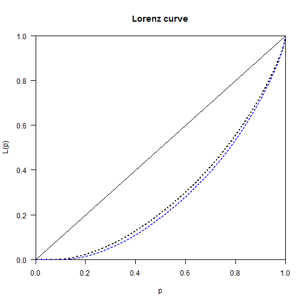

Inequality by Demographic Factors - Jura
========================================================


Load Library

```r
library(foreign,quietly=TRUE,warn.conflicts=FALSE)
library(plyr,quietly=TRUE,warn.conflicts=FALSE)
library(dplyr,quietly=TRUE,warn.conflicts=FALSE)
library(ggplot2,quietly=TRUE,warn.conflicts=FALSE)
library(ineq,quietly=TRUE,warn.conflicts=FALSE)
library(IC2,quietly=TRUE,warn.conflicts=FALSE)
```

Load Data 

```r
load("P:/WGS/FBS/ISS/Projekte laufend/SNF Ungleichheit/Valorisierung/Ungleichheitsworkshop Neuchatel 2014/Inequality by demographic factors/Auswertungen/datenju.Rda")
```


Achtung: 
* Einkommen sind nicht preisbereinigt. Vergleich der Mittelwerte über die Zeit sind damit nicht zu interpretieren
* Es wird die Ungleichheit zwischen Steuereinheiten und nicht zwischen Haushalten untersucht
* Es wurde keine Äquivalenzgewichtung vorgenommen


<br><br>
<br><br>

# Change of social structure and between group inequality

Werte kleiner 1 werden 1 gesetzt, der Theil möchte das so.

```r
datenju$TOTEINK[datenju$TOTEINK<1]<-1
```

## Periode: 2006 to 2011


### 2006

**Agegroup and mean Total income**

```r
prop.table(table(datenju$agegroup[datenju$steuerjahr==2006]))
```

```
## 
##  18-25  26-65    66+ 
## 0.1834 0.6023 0.2144
```

```r
by(datenju$TOTEINK[datenju$steuerjahr==2006],datenju$agegroup[datenju$steuerjahr==2006],mean)
```

```
## datenju$agegroup[datenju$steuerjahr == 2006]: 18-25
## [1] 19123
## -------------------------------------------------------- 
## datenju$agegroup[datenju$steuerjahr == 2006]: 26-65
## [1] 74739
## -------------------------------------------------------- 
## datenju$agegroup[datenju$steuerjahr == 2006]: 66+
## [1] 45498
```

**Housholdstructur and mean income**

```r
prop.table(table(datenju$household[datenju$steuerjahr==2006]))
```

```
## 
##    Married with Kid(s) Married without Kid(s)             Single man 
##                0.20291                0.19256                0.28371 
##           Single women             Single dad             Single mom 
##                0.29902                0.00365                0.01814
```

```r
by(datenju$TOTEINK[datenju$steuerjahr==2006],datenju$household[datenju$steuerjahr==2006],mean)
```

```
## datenju$household[datenju$steuerjahr == 2006]: Married with Kid(s)
## [1] 78601
## -------------------------------------------------------- 
## datenju$household[datenju$steuerjahr == 2006]: Married without Kid(s)
## [1] 106409
## -------------------------------------------------------- 
## datenju$household[datenju$steuerjahr == 2006]: Single man
## [1] 38232
## -------------------------------------------------------- 
## datenju$household[datenju$steuerjahr == 2006]: Single women
## [1] 32513
## -------------------------------------------------------- 
## datenju$household[datenju$steuerjahr == 2006]: Single dad
## [1] 70678
## -------------------------------------------------------- 
## datenju$household[datenju$steuerjahr == 2006]: Single mom
## [1] 57835
```


### 2011

**Agegroup and mean income**

```r
prop.table(table(datenju$agegroup[datenju$steuerjahr==2011]))
```

```
## 
##  18-25  26-65    66+ 
## 0.2034 0.5780 0.2186
```

```r
by(datenju$TOTEINK[datenju$steuerjahr==2011],datenju$agegroup[datenju$steuerjahr==2011],mean)
```

```
## datenju$agegroup[datenju$steuerjahr == 2011]: 18-25
## [1] 17524
## -------------------------------------------------------- 
## datenju$agegroup[datenju$steuerjahr == 2011]: 26-65
## [1] 78658
## -------------------------------------------------------- 
## datenju$agegroup[datenju$steuerjahr == 2011]: 66+
## [1] 51257
```

**Housholdstructur and mean income**

```r
prop.table(table(datenju$household[datenju$steuerjahr==2011]))
```

```
## 
##    Married with Kid(s) Married without Kid(s)             Single man 
##               0.183622               0.168758               0.308905 
##           Single women             Single dad             Single mom 
##               0.317723               0.003809               0.017182
```

```r
by(datenju$TOTEINK[datenju$steuerjahr==2011],datenju$household[datenju$steuerjahr==2011],mean)
```

```
## datenju$household[datenju$steuerjahr == 2011]: Married with Kid(s)
## [1] 86072
## -------------------------------------------------------- 
## datenju$household[datenju$steuerjahr == 2011]: Married without Kid(s)
## [1] 119417
## -------------------------------------------------------- 
## datenju$household[datenju$steuerjahr == 2011]: Single man
## [1] 38944
## -------------------------------------------------------- 
## datenju$household[datenju$steuerjahr == 2011]: Single women
## [1] 33964
## -------------------------------------------------------- 
## datenju$household[datenju$steuerjahr == 2011]: Single dad
## [1] 90725
## -------------------------------------------------------- 
## datenju$household[datenju$steuerjahr == 2011]: Single mom
## [1] 60636
```

<br><br>
<br><br>


# Change of overall inequality

## Periode 2006 to 2011

### 2006


```r
Gini(datenju$TOTEINK[datenju$steuerjahr==2006])
```

```
## [1] 0.4214
```

```r
Theil(datenju$TOTEINK[datenju$steuerjahr==2006])
```

```
## [1] 0.3199
```


### 2011


```r
Gini(datenju$TOTEINK[datenju$steuerjahr==2011])
```

```
## [1] 0.4495
```

```r
Theil(datenju$TOTEINK[datenju$steuerjahr==2011])
```

```
## [1] 0.364
```


### Lorenz curve


```r
Lc.2006<-Lc(datenju$TOTEINK[datenju$steuerjahr==2006])
Lc.2011<-Lc(datenju$TOTEINK[datenju$steuerjahr==2011])

plot(Lc.2006,lty="dotted")
lines(Lc.2011$p, Lc.2011$L,lty="dashed", lwd=1.2, col=4)
```

 

## Change of inequality measured with calcGEI (THEIL)


```r
# calcGEI kann nix mit 0 anfangen, macht aber das selbe
x.2006<-datenju$TOTEINK[datenju$steuerjahr==2006]
x.2006[x.2006<1]<-1
calcGEI(x.2006)
```

```
## $ineq
## $ineq$index
##    GEI 
## 0.3199 
## 
## $ineq$parameter
## alpha 
##     1 
## 
## 
## $nas
## $nas$xNA
## [1] 0
## 
## $nas$wNA
## NULL
## 
## $nas$totalNA
## [1] 0
## 
## 
## attr(,"class")
## [1] "ICI"
```

```r
Theil(x.2006)
```

```
## [1] 0.3199
```

```r
x.2011<-datenju$TOTEINK[datenju$steuerjahr==2011]
x.2011[x.2011<1]<-1
calcGEI(x.2011)
```

```
## $ineq
## $ineq$index
##   GEI 
## 0.364 
## 
## $ineq$parameter
## alpha 
##     1 
## 
## 
## $nas
## $nas$xNA
## [1] 0
## 
## $nas$wNA
## NULL
## 
## $nas$totalNA
## [1] 0
## 
## 
## attr(,"class")
## [1] "ICI"
```

```r
Theil(x.2011)
```

```
## [1] 0.364
```


<br><br>
<br><br>

# Decomposing overall inequality

## Households

### 2006
 

```r
decompGEI(x.2006,datenju$household[datenju$steuerjahr==2006])
```

```
## $ineq
## $ineq$index
##    GEI 
## 0.3217 
## 
## $ineq$parameter
## alpha 
##     1 
## 
## 
## $decomp
## $decomp$within
## [1] 0.2039
## 
## $decomp$between
## [1] 0.1177
## 
## $decomp$betweenELMO
## [1] 0.263
## 
## 
## $intra
## $intra$GEIGroups
##    Married with Kid(s) Married without Kid(s)             Single man 
##                 0.1494                 0.1221                 0.3875 
##           Single women             Single dad             Single mom 
##                 0.2653                 0.2201                 0.1618 
## 
## $intra$contribGEIGroups
##    Married with Kid(s) Married without Kid(s)             Single man 
##              0.0408573              0.0428850              0.0720799 
##           Single women             Single dad             Single mom 
##              0.0442280              0.0009739              0.0029099 
## 
## 
## $ws
## $ws$wIntra
##    Married with Kid(s) Married without Kid(s)             Single man 
##                0.20291                0.19256                0.28371 
##           Single women             Single dad             Single mom 
##                0.29902                0.00365                0.01814 
## 
## $ws$sIntra
##    Married with Kid(s) Married without Kid(s)             Single man 
##               0.273498               0.351369               0.186003 
##           Single women             Single dad             Single mom 
##               0.166718               0.004424               0.017989 
## 
## 
## $nas
## $nas$xNA
## [1] 0
## 
## $nas$zNA
## [1] 1314
## 
## $nas$wNA
## NULL
## 
## $nas$totalNA
## [1] 1314
## 
## 
## attr(,"class")
## [1] "ICI"
```


### 2011


```r
decompGEI(x.2011,datenju$household[datenju$steuerjahr==2011])
```

```
## $ineq
## $ineq$index
##    GEI 
## 0.3698 
## 
## $ineq$parameter
## alpha 
##     1 
## 
## 
## $decomp
## $decomp$within
## [1] 0.2332
## 
## $decomp$between
## [1] 0.1366
## 
## $decomp$betweenELMO
## [1] 0.306
## 
## 
## $intra
## $intra$GEIGroups
##    Married with Kid(s) Married without Kid(s)             Single man 
##                 0.1519                 0.1162                 0.4597 
##           Single women             Single dad             Single mom 
##                 0.3252                 0.1406                 0.1885 
## 
## $intra$contribGEIGroups
##    Married with Kid(s) Married without Kid(s)             Single man 
##              0.0399024              0.0389360              0.0919097 
##           Single women             Single dad             Single mom 
##              0.0583334              0.0008079              0.0032635 
## 
## 
## $ws
## $ws$wIntra
##    Married with Kid(s) Married without Kid(s)             Single man 
##               0.183622               0.168758               0.308905 
##           Single women             Single dad             Single mom 
##               0.317723               0.003809               0.017182 
## 
## $ws$sIntra
##    Married with Kid(s) Married without Kid(s)             Single man 
##               0.262687               0.334948               0.199949 
##           Single women             Single dad             Single mom 
##               0.179356               0.005744               0.017316 
## 
## 
## $nas
## $nas$xNA
## [1] 0
## 
## $nas$zNA
## [1] 1490
## 
## $nas$wNA
## NULL
## 
## $nas$totalNA
## [1] 1490
## 
## 
## attr(,"class")
## [1] "ICI"
```


#### Interpretation

* Grundsätzlich: Der Anteil lediger ist extrem hoch (fast 60%) das ist aber auch bei den Brülhartdaten so. Trotzdem irgendwie strange...
* Overall Ungleichheit nimmt geringfügig zu, nicht aber, weil Between-Group inequality grösser geworden wäre
* Beitrag der Between-Group Ungleichheit zur Overall Ungleichheit ist sehr hoch (2006:36.6%, 2011:36.9%) 
* Verheiratete ohne Kinder verfügen über ein deutlich höheres Einkommen wie die übliche Gruppen


## Agegroups

### 2006
 

```r
decompGEI(x.2006,datenju$agegroup[datenju$steuerjahr==2006])
```

```
## $ineq
## $ineq$index
##    GEI 
## 0.3199 
## 
## $ineq$parameter
## alpha 
##     1 
## 
## 
## $decomp
## $decomp$within
## [1] 0.2362
## 
## $decomp$between
## [1] 0.08377
## 
## $decomp$betweenELMO
## [1] 0.2084
## 
## 
## $intra
## $intra$GEIGroups
##  18-25  26-65    66+ 
## 0.5381 0.2248 0.1801 
## 
## $intra$contribGEIGroups
##   18-25   26-65     66+ 
## 0.03237 0.17365 0.03014 
## 
## 
## $ws
## $ws$wIntra
##  18-25  26-65    66+ 
## 0.1834 0.6023 0.2144 
## 
## $ws$sIntra
##   18-25   26-65     66+ 
## 0.06017 0.77244 0.16739 
## 
## 
## $nas
## $nas$xNA
## [1] 0
## 
## $nas$zNA
## [1] 0
## 
## $nas$wNA
## NULL
## 
## $nas$totalNA
## [1] 0
## 
## 
## attr(,"class")
## [1] "ICI"
```


### 2011


```r
decompGEI(x.2011,datenju$agegroup[datenju$steuerjahr==2011])
```

```
## $ineq
## $ineq$index
##   GEI 
## 0.364 
## 
## $ineq$parameter
## alpha 
##     1 
## 
## 
## $decomp
## $decomp$within
## [1] 0.2656
## 
## $decomp$between
## [1] 0.09835
## 
## $decomp$betweenELMO
## [1] 0.2465
## 
## 
## $intra
## $intra$GEIGroups
##  18-25  26-65    66+ 
## 0.6467 0.2544 0.1900 
## 
## $intra$contribGEIGroups
##   18-25   26-65     66+ 
## 0.03826 0.19200 0.03535 
## 
## 
## $ws
## $ws$wIntra
##  18-25  26-65    66+ 
## 0.2034 0.5780 0.2186 
## 
## $ws$sIntra
##   18-25   26-65     66+ 
## 0.05916 0.75479 0.18604 
## 
## 
## $nas
## $nas$xNA
## [1] 0
## 
## $nas$zNA
## [1] 0
## 
## $nas$wNA
## NULL
## 
## $nas$totalNA
## [1] 0
## 
## 
## attr(,"class")
## [1] "ICI"
```


#### Interpretation


* Beitrag der Between-Group Ungleichheit zur Overall Ungleichheit ist auch bezüglich Altersgruppen sehr hoch (2006:26.2%) und hat geringfügig zugenommen (2011: 27.0%)


#### Anschlussfrage

* Weshalb ist die Between Group inequality in Jura so viel höher, wie in Basel?


