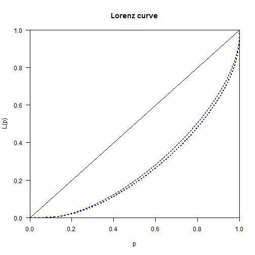

Inequality by Demographic Factors - Züirch
========================================================


Load Library

```r
library(foreign,quietly=TRUE,warn.conflicts=FALSE)
library(plyr,quietly=TRUE,warn.conflicts=FALSE)
library(dplyr,quietly=TRUE,warn.conflicts=FALSE)
library(ggplot2,quietly=TRUE,warn.conflicts=FALSE)
library(ineq,quietly=TRUE,warn.conflicts=FALSE)
library(IC2,quietly=TRUE,warn.conflicts=FALSE)
```

Load Data 

```r
load("P:/WGS/FBS/ISS/Projekte laufend/SNF Ungleichheit/Valorisierung/Ungleichheitsworkshop Neuchatel 2014/Inequality by demographic factors/Auswertungen/datenzh.Rda")
```


Achtung: 
* Einkommen sind nicht preisbereinigt. Vergleich der Mittelwerte über die Zeit sind damit nicht zu interpretieren
* Es wird die Ungleichheit zwischen Steuereinheiten und nicht zwischen Haushalten untersucht
* Es wurde keine Äquivalenzgewichtung vorgenommen


<br><br>
<br><br>

# Change of social structure and between group inequality

Werte kleiner 1 werden 1 gesetzt, der Theil möchte das so.

```r
datenzh$STE<-datenzh$STEUERBARES_EINKOMMEN
datenzh$STE[datenzh$STE<1]<-1
```

## Periode: 1991 bis 2007


### 1991

**Agegroup and median income**

```r
prop.table(table(datenzh$agegroup[datenzh$steuerjahr==1991]))
```

```
## 
##  18-25  26-65    66+ 
## 0.1323 0.6649 0.2028
```

```r
by(datenzh$STE[datenzh$steuerjahr==1991],datenzh$agegroup[datenzh$steuerjahr==1991],median)
```

```
## datenzh$agegroup[datenzh$steuerjahr == 1991]: 18-25
## [1] 18.9
## -------------------------------------------------------- 
## datenzh$agegroup[datenzh$steuerjahr == 1991]: 26-65
## [1] 42
## -------------------------------------------------------- 
## datenzh$agegroup[datenzh$steuerjahr == 1991]: 66+
## [1] 18.8
```

**Housholdstructur and median income**

```r
prop.table(table(datenzh$household[datenzh$steuerjahr==1991]))
```

```
## 
##    Married with Kid(s) Married without Kid(s)             Single man 
##               0.232612               0.211306               0.251178 
##           Single women             Single dad             Single mom 
##               0.296815               0.006072               0.002017
```

```r
by(datenzh$STE[datenzh$steuerjahr==1991],datenzh$household[datenzh$steuerjahr==1991],median)
```

```
## datenzh$household[datenzh$steuerjahr == 1991]: Married with Kid(s)
## [1] 51
## -------------------------------------------------------- 
## datenzh$household[datenzh$steuerjahr == 1991]: Married without Kid(s)
## [1] 48.1
## -------------------------------------------------------- 
## datenzh$household[datenzh$steuerjahr == 1991]: Single man
## [1] 30.9
## -------------------------------------------------------- 
## datenzh$household[datenzh$steuerjahr == 1991]: Single women
## [1] 24.5
## -------------------------------------------------------- 
## datenzh$household[datenzh$steuerjahr == 1991]: Single dad
## [1] 37.4
## -------------------------------------------------------- 
## datenzh$household[datenzh$steuerjahr == 1991]: Single mom
## [1] 25.2
```


### 2007

**Agegroup and median income**

```r
prop.table(table(datenzh$agegroup[datenzh$steuerjahr==2007]))
```

```
## 
##  18-25  26-65    66+ 
## 0.1299 0.6557 0.2144
```

```r
by(datenzh$STE[datenzh$steuerjahr==2007],datenzh$agegroup[datenzh$steuerjahr==2007],median)
```

```
## datenzh$agegroup[datenzh$steuerjahr == 2007]: 18-25
## [1] 12.7
## -------------------------------------------------------- 
## datenzh$agegroup[datenzh$steuerjahr == 2007]: 26-65
## [1] 54.9
## -------------------------------------------------------- 
## datenzh$agegroup[datenzh$steuerjahr == 2007]: 66+
## [1] 41.9
```

**Housholdstructur and median income**

```r
prop.table(table(datenzh$household[datenzh$steuerjahr==2007]))
```

```
## 
##    Married with Kid(s) Married without Kid(s)             Single man 
##               0.244408               0.129145               0.302249 
##           Single women             Single dad             Single mom 
##               0.305325               0.007608               0.011264
```

```r
by(datenzh$STE[datenzh$steuerjahr==2007],datenzh$household[datenzh$steuerjahr==2007],median)
```

```
## datenzh$household[datenzh$steuerjahr == 2007]: Married with Kid(s)
## [1] 68.6
## -------------------------------------------------------- 
## datenzh$household[datenzh$steuerjahr == 2007]: Married without Kid(s)
## [1] 64.85
## -------------------------------------------------------- 
## datenzh$household[datenzh$steuerjahr == 2007]: Single man
## [1] 42
## -------------------------------------------------------- 
## datenzh$household[datenzh$steuerjahr == 2007]: Single women
## [1] 36.9
## -------------------------------------------------------- 
## datenzh$household[datenzh$steuerjahr == 2007]: Single dad
## [1] 48.65
## -------------------------------------------------------- 
## datenzh$household[datenzh$steuerjahr == 2007]: Single mom
## [1] 31.2
```

<br><br>
<br><br>


# Change of overall inequality

## Periode 1991 to 2007

### 1991


```r
Gini(datenzh$STE[datenzh$steuerjahr==1991])
```

```
## [1] 0.4914
```

```r
Theil(datenzh$STE[datenzh$steuerjahr==1991])
```

```
## [1] 0.5646
```


### 2007


```r
Gini(datenzh$STE[datenzh$steuerjahr==2007])
```

```
## [1] 0.4639
```

```r
Theil(datenzh$STE[datenzh$steuerjahr==2007])
```

```
## [1] 0.4685
```


### Lorenz curve


```r
Lc.1991<-Lc(datenzh$STE[datenzh$steuerjahr==1991])
Lc.2007<-Lc(datenzh$STE[datenzh$steuerjahr==2007])

plot(Lc.1991,lty="dotted")
lines(Lc.2007$p, Lc.2007$L,lty="dashed", lwd=1.2, col=4)
```

 

## Change of inequality measured with calcGEI (THEIL)


```r
# calcGEI kann nix mit 0 anfangen, macht aber das selbe
x.1991<-datenzh$STE[datenzh$steuerjahr==1991]
x.1991[x.1991<1]<-1
calcGEI(x.1991)
```

```
## $ineq
## $ineq$index
##    GEI 
## 0.5646 
## 
## $ineq$parameter
## alpha 
##     1 
## 
## 
## $nas
## $nas$xNA
## [1] 0
## 
## $nas$wNA
## NULL
## 
## $nas$totalNA
## [1] 0
## 
## 
## attr(,"class")
## [1] "ICI"
```

```r
Theil(x.1991)
```

```
## [1] 0.5646
```

```r
x.2007<-datenzh$STE[datenzh$steuerjahr==2007]
x.2007[x.2007<1]<-1
calcGEI(x.2007)
```

```
## $ineq
## $ineq$index
##    GEI 
## 0.4685 
## 
## $ineq$parameter
## alpha 
##     1 
## 
## 
## $nas
## $nas$xNA
## [1] 0
## 
## $nas$wNA
## NULL
## 
## $nas$totalNA
## [1] 0
## 
## 
## attr(,"class")
## [1] "ICI"
```

```r
Theil(x.2007)
```

```
## [1] 0.4685
```


<br><br>
<br><br>

# Decomposing overall inequality

## Households

### 1991
 

```r
decompGEI(x.1991,datenzh$household[datenzh$steuerjahr==1991])
```

```
## $ineq
## $ineq$index
##   GEI 
## 0.546 
## 
## $ineq$parameter
## alpha 
##     1 
## 
## 
## $decomp
## $decomp$within
## [1] 0.47
## 
## $decomp$between
## [1] 0.07599
## 
## $decomp$betweenELMO
## [1] 0.3153
## 
## 
## $intra
## $intra$GEIGroups
##    Married with Kid(s) Married without Kid(s)             Single man 
##                 0.5151                 0.4630                 0.4227 
##           Single women             Single dad             Single mom 
##                 0.4479                 0.2891                 0.7966 
## 
## $intra$contribGEIGroups
##    Married with Kid(s) Married without Kid(s)             Single man 
##               0.172040               0.139650               0.076152 
##           Single women             Single dad             Single mom 
##               0.079253               0.001635               0.001306 
## 
## 
## $ws
## $ws$wIntra
##    Married with Kid(s) Married without Kid(s)             Single man 
##               0.232612               0.211306               0.251178 
##           Single women             Single dad             Single mom 
##               0.296815               0.006072               0.002017 
## 
## $ws$sIntra
##    Married with Kid(s) Married without Kid(s)             Single man 
##               0.333992               0.301603               0.180158 
##           Single women             Single dad             Single mom 
##               0.176952               0.005655               0.001639 
## 
## 
## $nas
## $nas$xNA
## [1] 0
## 
## $nas$zNA
## [1] 4409
## 
## $nas$wNA
## NULL
## 
## $nas$totalNA
## [1] 4409
## 
## 
## attr(,"class")
## [1] "ICI"
```


### 2007


```r
decompGEI(x.2007,datenzh$household[datenzh$steuerjahr==2007])
```

```
## $ineq
## $ineq$index
##    GEI 
## 0.4764 
## 
## $ineq$parameter
## alpha 
##     1 
## 
## 
## $decomp
## $decomp$within
## [1] 0.416
## 
## $decomp$between
## [1] 0.06045
## 
## $decomp$betweenELMO
## [1] 0.3288
## 
## 
## $intra
## $intra$GEIGroups
##    Married with Kid(s) Married without Kid(s)             Single man 
##                 0.4030                 0.4628                 0.4240 
##           Single women             Single dad             Single mom 
##                 0.3753                 0.6193                 0.4539 
## 
## $intra$contribGEIGroups
##    Married with Kid(s) Married without Kid(s)             Single man 
##               0.141362               0.088282               0.101172 
##           Single women             Single dad             Single mom 
##               0.076620               0.005395               0.003137 
## 
## 
## $ws
## $ws$wIntra
##    Married with Kid(s) Married without Kid(s)             Single man 
##               0.244408               0.129145               0.302249 
##           Single women             Single dad             Single mom 
##               0.305325               0.007608               0.011264 
## 
## $ws$sIntra
##    Married with Kid(s) Married without Kid(s)             Single man 
##               0.350812               0.190765               0.238620 
##           Single women             Single dad             Single mom 
##               0.204181               0.008711               0.006912 
## 
## 
## $nas
## $nas$xNA
## [1] 0
## 
## $nas$zNA
## [1] 19346
## 
## $nas$wNA
## NULL
## 
## $nas$totalNA
## [1] 19346
## 
## 
## attr(,"class")
## [1] "ICI"
```


## Agegroups

### 1991
 

```r
decompGEI(x.1991,datenzh$agegroup[datenzh$steuerjahr==1991])
```

```
## $ineq
## $ineq$index
##    GEI 
## 0.5646 
## 
## $ineq$parameter
## alpha 
##     1 
## 
## 
## $decomp
## $decomp$within
## [1] 0.5211
## 
## $decomp$between
## [1] 0.04342
## 
## $decomp$betweenELMO
## [1] 0.2096
## 
## 
## $intra
## $intra$GEIGroups
##  18-25  26-65    66+ 
## 0.3721 0.4117 1.0860 
## 
## $intra$contribGEIGroups
##   18-25   26-65     66+ 
## 0.01998 0.32145 0.17970 
## 
## 
## $ws
## $ws$wIntra
##  18-25  26-65    66+ 
## 0.1323 0.6649 0.2028 
## 
## $ws$sIntra
##   18-25   26-65     66+ 
## 0.05371 0.78082 0.16548 
## 
## 
## $nas
## $nas$xNA
## [1] 0
## 
## $nas$zNA
## [1] 0
## 
## $nas$wNA
## NULL
## 
## $nas$totalNA
## [1] 0
## 
## 
## attr(,"class")
## [1] "ICI"
```


### 2007


```r
decompGEI(x.2007,datenzh$agegroup[datenzh$steuerjahr==2007])
```

```
## $ineq
## $ineq$index
##  GEI 
## 0.48 
## 
## $ineq$parameter
## alpha 
##     1 
## 
## 
## $decomp
## $decomp$within
## [1] 0.4333
## 
## $decomp$between
## [1] 0.04669
## 
## $decomp$betweenELMO
## [1] 0.2022
## 
## 
## $intra
## $intra$GEIGroups
##  18-25  26-65    66+ 
## 0.5755 0.4179 0.4607 
## 
## $intra$contribGEIGroups
##   18-25   26-65     66+ 
## 0.02475 0.31504 0.09355 
## 
## 
## $ws
## $ws$wIntra
##  18-25  26-65    66+ 
## 0.1299 0.6557 0.2144 
## 
## $ws$sIntra
##  18-25  26-65    66+ 
## 0.0430 0.7539 0.2031 
## 
## 
## $nas
## $nas$xNA
## [1] 0
## 
## $nas$zNA
## [1] 7976
## 
## $nas$wNA
## NULL
## 
## $nas$totalNA
## [1] 7976
## 
## 
## attr(,"class")
## [1] "ICI"
```

